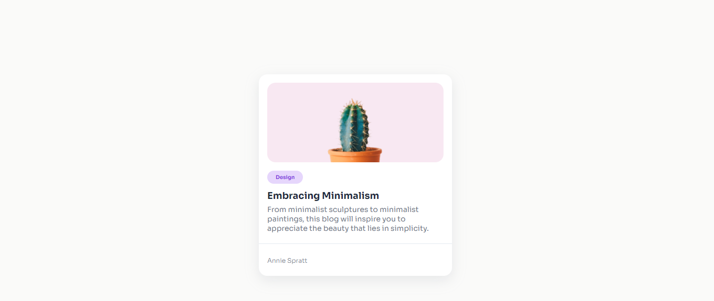
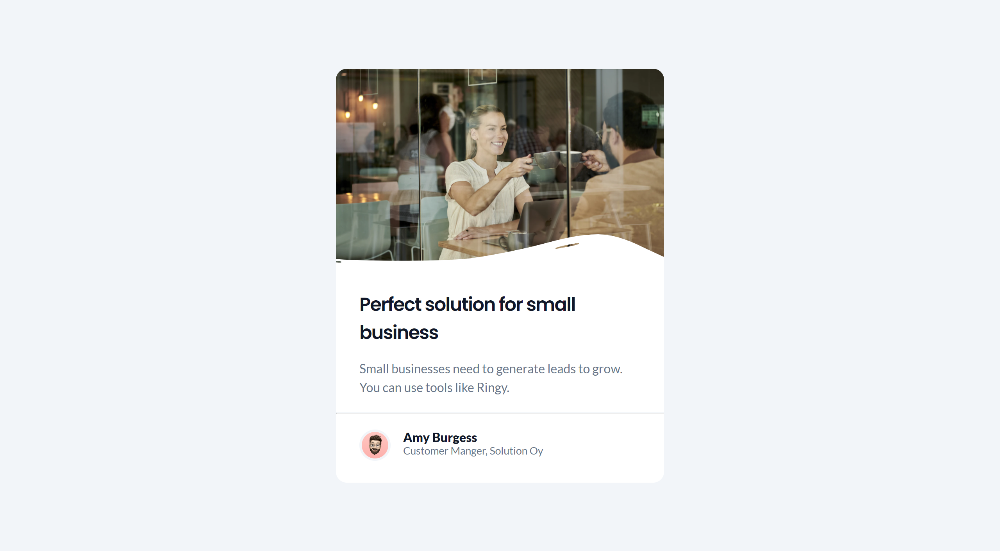

# devChallengues

These challenges are proposed by [devChallenges](https://devchallenges.io/)

## 📌 Resposive web Developer

### 1. Minimal Blog Card

This challenge is to create a simple blog card that includes an image, a tag, a title and short description.

- HTML
- CSS

👉 [Challenge](https://devchallenges.io/challenge/minimal-blog-card) |
[Demo](https://65ed438ad83a6d2c24751520--cozy-lamington-251652.netlify.app/) |
[Repo](https://github.com/HLena/devChallengues/tree/main/1-resposive-web/1-minimal-blog-card)

### 2. Business Blog Card

This challenge is to create a business blog card that challenges you to use flexbox, positioning, etc.

- HTML
- CSS

👉 [Challenge](https://devchallenges.io/challenge/business-blog-card) |
[Demo](https://65ee41a6d83a6dcdc57513cf--stellar-granita-db6fcf.netlify.app/) |
[Repo](https://github.com/HLena/devChallengues/tree/main/1-resposive-web/2-business-blog-card)

